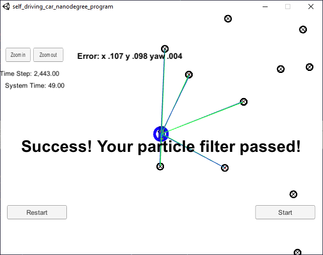

# Kidnapped Vehicle
This is a Udacity Self-Driving Car NanoDegree project submission that uses a particle filter to estimate the position and heading of a simulated moving vehicle with noisy sensor measurements of simulated landmarks. 


> *Particle filter error at the last time step was 0.107 and 0.098 meters along the x and y axis respectively, and the heading error was 0.004 radians. The particle filter was able to complete the simulation in 49 seconds.*

## Table of Contents
- [**Installation**](#installation)
- [**Usage**](#usage)
- [**Main Project Files**](#main-project-files)
- [**The Particle Filter**](#the-particle-filter)
  - [Inputs to the Particle Filter](#inputs-to-the-particle-filter)
  - [Initialization](#initialization)
  - [Prediction](#prediction)
  - [Particle Weights](#particle-weights)
  - [Particle Resampling ](#particle-resampling)
  - [Selecting and Plotting the "Best Particle" to Estimate Position of Kidnapped Vehicle](#selecting-and-plotting-the-best-particle-to-estimate-position-of-kidnapped-vehicle)
- [**Evaluation**](#evaluation)

## Installation
* Clone or fork this repository. 
* Install [Udacity's Term 2 Simulator](https://github.com/udacity/self-driving-car-sim/releases) which allows the user to visualize the moving object, lidar and radar sensor data, and the kalman filter estimated positions.
* Install [uWebSocketIO](https://github.com/uNetworking/uWebSockets) which allows the project to send data to the Term 2 Simulator.
  * Linux: run the script `install-ubuntu.sh`.
  * Mac: run the script `install-mac.sh`.
  * Windows: install Ubuntu Bash enviroment, clone repo in Ubuntu Bash environment, then run the linux install script `install-ubuntu.sh`.
* Troubleshooting tips can be found on this [Udacity knowledge post](https://knowledge.udacity.com/questions/5184).

## Usage
Intended user is the Udacity evaluator for this project. 

1. Run the following from the project directory:
   * `cd build`
   * `./particle_filter`
2. Run the Term 2 Simulator.
   * In the main menu screen select Project 3: Kidnapped Vehicle.
   * Click the START button to observe the vehicle moving.
     * The vehicle symbol indicates the ground truth position and heading of the kidnapped vehicle.
     * The blue circle with arrow indicates the particle filter's estimated position and heading of the kidnapped vehicle.
     * Green lines extending from vehicle are ground truth measurements to landmarks around vehicle.
     * Blue lines extending from vehicle are estimated measurements to landmarks around vehicle.
     * Error values for vehicle's position (meters) and heading (radians) components are also displayed.
     
## Main Project Files
The C++ code and headers can be found in the `src` folder.
* `particle_filter.cpp`: manages the particle_filter class for calculating the estimated vehicle position and heading.

To compile the source code, run the following from the main project directory:
* `cd build`
* `cmake ..`
* `make`

## The Particle Filter

The following sections describe the behavior of the particle filter.

### Inputs to the Particle Filter

Inputs to the particle filter include a map of landmarks: 

`map_data.txt` contains position of landmarks (in meters) in Cartesian coordinates. Each row has three columns
1. x position
2. y position
3. landmark id
> *Map data provided by 3D Mapping Solutions GmbH.*

Sensor observations of landmarks (from vehicle's frame of reference), velocity, and yaw are provided by the simulator.

### Initialization

The particle filter initializes 1000 particles with a Gaussian distribution around the first position and sets all the weights to 1.

```cpp
void ParticleFilter::init(double x, double y, double theta, double std[]) {

  num_particles = 1000;  // TODO: Set the number of particles
  particles.resize(num_particles);
  weights.resize(particles.size());
  
  normal_distribution<double> dist_x(x, std[X]);
  normal_distribution<double> dist_y(y, std[Y]);
  normal_distribution<double> dist_theta(theta, std[THETA]);
   
  for (int i = 0; i < particles.size(); i++) {
    Particle& p = particles[i];
    p.id       = i;
    p.x        = dist_x(Gen);
    p.y        = dist_y(Gen);
    p.theta    = dist_theta(Gen);
    p.weight   = 1.0;
    weights[i] = p.weight;
  }

  is_initialized = true;
}
```

### Prediction

The state of each particle is then predicted with the vehicle's (noiseless) velocity and yaw rate using basic geometry.

To predict the particle state with zero yaw, the following was used:

```cpp
void predictionYawZero(double delta_t, double std_pos[], double velocity, 
    std::vector<Particle>& particles) {
          
  double dist = velocity * delta_t;

  for (int i = 0; i < particles.size(); i ++) {

    Particle& p = particles[i];
    
    double pred_x = p.x + dist * cos(p.theta);
    double pred_y = p.y + dist * sin(p.theta);
    
    setState(pred_x, pred_y, p.theta, std_pos, p);
  }
}
```

To predict the particle state with yaw rate, the following was used:

```cpp
void predictionYawNonZero(double delta_t, double std_pos[], double velocity, 
      double yaw_rate, std::vector<Particle>& particles)  {
        
  double v_per_yaw_rate = velocity / yaw_rate;
  
  for (int i = 0; i < particles.size(); i ++) {

    Particle& p = particles[i];
    
    double pred_theta = p.theta + yaw_rate*delta_t;
    double pred_x = p.x + v_per_yaw_rate * (sin(pred_theta) - sin(p.theta));
    double pred_y = p.y + v_per_yaw_rate * (cos(p.theta) - cos(pred_theta));
    
    setState(pred_x, pred_y, pred_theta, std_pos, p);
  }
```

Once the predicted position and heading of each particle is calculated, noise is applied and the state is set.

```cpp
void setState (double pred_x, double pred_y, double pred_theta, 
    double std_pos[], Particle& p) {
  
  normal_distribution<double> dist_x    (pred_x, std_pos[X]);
  normal_distribution<double> dist_y    (pred_y, std_pos[Y]);
  normal_distribution<double> dist_theta(pred_theta, std_pos[THETA]);
  
  p.x     = dist_x(Gen);
  p.y     = dist_y(Gen);
  p.theta = dist_theta(Gen);
}
```

### Particle Weights

The weights of each particle are calculated based on the sensor measurements of surrounding landmarks. The probability of a sensor meausurement to a landmark is calculated using a multivariate Gaussian distribution. The weight of the particle is then the poduct of the probabilities of these sensor measurements.

Landmarks within the sensor range of the particle are selected from the map.

```cpp
void selectInRange(const Particle& p, double sensor_range, 
                   const Map &map_landmarks, 
                   vector<LandmarkObs> &predicted_landmarks) {
  
  for (int i = 0; i < map_landmarks.landmark_list.size(); i ++) {
    
    Map::single_landmark_s l = map_landmarks.landmark_list[i];
    double d = dist(p.x, p.y, l.x_f, l.y_f);
    
    if (d <= sensor_range) {
      // landmark l is in sensor range of particle p
      LandmarkObs landmark_inrange;
      landmark_inrange.id = l.id_i;
      landmark_inrange.x  = l.x_f;
      landmark_inrange.y  = l.y_f;
      predicted_landmarks.push_back(landmark_inrange);
    }
  }
  
}
```

The sensor measurements are in the vehicle's frame of reference (vehicle is origin). To calculate the weights correctly, the sensor measurements must be transformed to the map's frame of reference using translation and rotation about each particle.

```cpp
void transformToMap(const Particle &p, 
                    const vector<LandmarkObs> &observations, 
                    vector<LandmarkObs> &map_observations) {

  for (int i = 0; i < observations.size(); i ++) {
    
    LandmarkObs o = observations[i];
    
    double cos_theta = cos(p.theta);
    double sin_theta = sin(p.theta);
    double x_map = p.x + o.x*cos_theta - o.y*sin_theta;
    double y_map = p.y + o.x*sin_theta + o.y*cos_theta;
    
    LandmarkObs map_observation;
    map_observation.x  = x_map;
    map_observation.y  = y_map;
    map_observations.push_back(map_observation);
    
  }
}
```

Landmarks in range are matched to the transformed sensor measurements based on shortest distance. 

This matching will be used to calculate the distance between the position of the landmark and position of the observation.

```cpp
void ParticleFilter::dataAssociation(vector<LandmarkObs> predicted, 
                                     vector<LandmarkObs>& observations) {
    
    LandmarkObs& o = observations[i];
    double lowest = INFINITY;
    int id_closest;
    
    for (int j = 0; j < predicted.size(); j ++) {
      
      LandmarkObs& p = predicted[j];
      double d = dist(o.x, o.y, p.x, p.y);
      if (d < lowest) {
        id_closest = j;
        lowest = d;
      }
    }
    
    // save index of closest landmark to id field of observation
    // the closest landmark to an obsevation o is now found by:
    // closest_landmark = landmark[o.id]
    o.id = id_closest;
  }
}
```

The probability of each observation from a particle can then be calculated using the distance between the observation and it's associated landmark using the probability density function of a multivariate gaussian distribution. 

The closer the position of the observation is to its matched landmark, the higher the probability (up to 1.0).

The farther the position of observation is to its matched landmark, the lower the probability.

The weight of the particle is the product of the probabilities of the observations.

Landmarks are associated with each particle for debugging using `SetAssociations()`.

```cpp
void ParticleFilter::updateWeights(double sensor_range, double std_landmark[], 
                                   const vector<LandmarkObs> &observations, 
                                   const Map &map_landmarks) {
   
  // calculate normlizer used for mult-variate gaussian calculations
  double std_x = std_landmark[0];
  double std_y = std_landmark[1];
  double normalizer = 2 * M_PI * std_x * std_y;
   
  for (int i = 0; i < particles.size(); i ++) {
    
    Particle& p = particles[i];
    
    // select landmarks in sensor range of particle p
    vector<LandmarkObs> map_predicted_landmarks;
    selectInRange(p, sensor_range, map_landmarks, map_predicted_landmarks);
  
    // transform observed landmarks from vehicle to map coordinates
    vector<LandmarkObs> map_observations;
    transformToMap(p, observations, map_observations);
    
    // associate nearest predicted landmark to observed landmark
    dataAssociation(map_predicted_landmarks, map_observations);
    
    // set up variables to record landmarks associated with particle p
    vector<int> associations;   // landmark id associated with particle p
    vector<double> sense_x;     // observed x coordinate of landmark
    vector<double> sense_y;     // observed y coordinate of landmark

    // calculate particle weight
    p.weight = 1.0;
    
    for (int j = 0; j < map_observations.size(); j ++) {
      
      LandmarkObs map_o = map_observations[j];
      // map_o.id is the id of the closest predicted_landmark
      LandmarkObs map_closest = map_predicted_landmarks[map_o.id];
      
      // calculate weight of particle using mult-variate gaussian
      double dx = (map_o.x - map_closest.x);
      double dy = (map_o.y - map_closest.y);
      double e = exp(-((dx*dx)/(2*std_x*std_x) + (dy*dy)/(2*std_y*std_y)));
      
      p.weight *= (e / normalizer);
      
      // record closest landmark as associated with particle p
      associations.push_back(map_closest.id);  // save id of landmark
      sense_x.push_back(map_o.x);              // save observed x coordinate
      sense_y.push_back(map_o.y);              // save observed y coordinate
    }
    
    SetAssociations(p, associations, sense_x, sense_y);
    
    // vector of weights will be used in 
    // discrete_distribution in ParticleFilter::resample
    weights[i] = p.weight;
    
  }
}
```

### Particle Resampling 

With the weights of each particle calculated, the particle filter selects samples from based on each particles weight. 

Selection of each particle uses a `discrete_distribution` initialized by the particle filter's `weights` vector.

The larger the weight of the particle, the more likely it is to be selected by the filter. Lower weight particles are eventually "filtered" out over each time step.

```cpp
void ParticleFilter::resample() {
  /**
   * TODO: Resample particles with replacement with probability proportional 
   *   to their weight. 
   * NOTE: You may find std::discrete_distribution helpful here.
   *   http://en.cppreference.com/w/cpp/numeric/random/discrete_distribution
   */

  // setup discrete distribution using the calculated weights
  std::discrete_distribution<int> dist(weights.begin(), weights.end());
  
  // vector of particles selected from sample
  std::vector<Particle> selected;
  
  // select particles from sample according to discrete_distribution dist
  // this is the part the filters out particles
  for (int n = 0; n < particles.size(); n ++) {
    
    int i = dist(Gen);
    selected.push_back(particles[i]);
  }
  
  // clear out existing set of particles
  particles.clear();
  
  // save selected to particles for use in next iteration
  particles.assign(selected.begin(), selected.end());
  
}
```

### Selecting and Plotting the "Best Particle" to Estimate Position of Kidnapped Vehicle

With the lower weight particles filtered out of the sample set, the particle with the highest weight (best particle) from this sample represents the best estimate of the vehicle's position.

```cpp
// from main.cpp (Udacity's code)

//...etc...

vector<Particle> particles = pf.particles;
int num_particles = particles.size();
double highest_weight = -1.0;
Particle best_particle;
double weight_sum = 0.0;
for (int i = 0; i < num_particles; ++i) {
  if (particles[i].weight > highest_weight) {
    highest_weight = particles[i].weight;
    best_particle = particles[i];
  }

  weight_sum += particles[i].weight;
}

//...etc...

```

The simulator uses the the best particle to plot the estimated position and heading of the vehicle. The position and heading of the best particle is designated by a blue circle and arrow on the simulator window.

The best particle's associated landmarks (set in `ParticleFilter::updateWeights()`) are also sent to the simulator. The simulator uses these associations to draw blue lines from the best particle position to the associated landmarks.

```cpp
// from main.cpp (Udacity's code)

//...etc...

json msgJson;
msgJson["best_particle_x"] = best_particle.x;
msgJson["best_particle_y"] = best_particle.y;
msgJson["best_particle_theta"] = best_particle.theta;

// Optional message data used for debugging particle's sensing 
//   and associations
msgJson["best_particle_associations"] = pf.getAssociations(best_particle);
msgJson["best_particle_sense_x"] = pf.getSenseCoord(best_particle, "X");
msgJson["best_particle_sense_y"] = pf.getSenseCoord(best_particle, "Y");

auto msg = "42[\"best_particle\"," + msgJson.dump() + "]";
// std::cout << msg << std::endl;
ws.send(msg.data(), msg.length(), uWS::OpCode::TEXT);

//...etc...

```

The accuracy of the particle filter can be observed with how close the blue circle is centered about the vehicle symbol. Additionally, the error in meters and radians is also displayed.

The subsequent time steps continue with prediction (given velocity and yaw inputs from the simulator) through resampling. 

Over time, the lower probability particles are filtered out, while the more accurate particles are selected into the sample, thus providing a highly accurate position of the kidnapped vehicle.

## Evaluation


